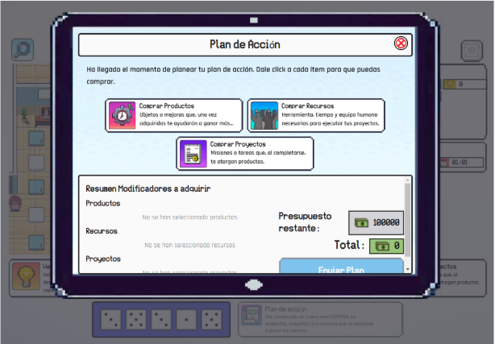

# Challenge Doctums Frontend

## Tabla de Contenidos

- [Challenge Doctums Frontend](#challenge-doctums-frontend)
  - [Tabla de Contenidos](#tabla-de-contenidos)
  - [Descripción](#descripción)
  - [Detalles del juego y reglas](#detalles-del-juego-y-reglas)
    - [Explicación del Juego](#explicación-del-juego)
    - [Inicio del Turno, Avance de Días y Plan de Acción](#inicio-del-turno-avance-de-días-y-plan-de-acción)
    - [Eventos Inesperados](#eventos-inesperados)
    - [Modificadores](#modificadores)
    - [Finalizar un Turno](#finalizar-un-turno)
  - [Detalles técnicos](#detalles-técnicos)
  - [Integrantes del Equipo](#integrantes-del-equipo)
  - [Tecnologías Utilizadas](#tecnologías-utilizadas)
  - [Instalación](#instalación)
  - [Uso](#uso)
    - [Scripts Disponibles](#scripts-disponibles)
    - [Disclaimer](#disclaimer)
  - [Licencia](#licencia)
  - [Agradecimientos](#agradecimientos)

## Descripción

El presente proyecto es un videojuego de mesa con temática educacional para fomentar el entrenamiento en la toma de buenas decisiones empresariales. Este proyecto es nuestra participación en una competencia propuesta por la empresa Doctums y Certus.


## Detalles del juego y reglas
### Explicación del Juego
Challenge Doctums es un juego donde cada jugador asume el rol de líder de proyecto para una empresa, simulando la toma de decisiones estratégicas. Los jugadores deberán administrar su presupuesto y recursos estratégicamente para obtener los mayores beneficios durante toda la partida.


El juego permite la conexión de hasta 4 jugadores en una partida, a la cual pueden acceder mediante un código de acceso compartido por la persona que crea la partida. Cada jugador podrá, en tiempo real, conocer la situación actual de los otros participantes.


### Inicio del Turno, Avance de Días y Plan de Acción


Los turnos inician con el lanzamiento de dados, lo que determina cuántas casillas avanzará el jugador. Las casillas representan los días de cada mes durante los 12 meses del año. A medida que el jugador lanza los dados y los días avanzan, existen más posibilidades de que retos más desafiantes se presenten. La dificultad está indicada por el número que aparece en la casilla: mientras más alto sea el número, más difícil será el evento, simulando situaciones similares a las del ámbito laboral.


Asumiendo el rol de líder, cada jugador debe planificar un plan de acción efectivo para el mes, basándose en los modificadores disponibles. Un plan de acción exitoso es aquel que brinda los mayores beneficios y permite cumplir con todos los retos presentados durante el mes.



### Eventos Inesperados
Los jugadores saben que, tarde o temprano, tendrán que poner a prueba las fortalezas que han acumulado mediante los eventos. Estas fortalezas son los modificadores obtenidos a través de los planes de acción y los éxitos al completar eventos exitosamente. A medida que avanzan los días, los eventos se vuelven cada vez más desafiantes.


Lo que el jugador no sabe es qué evento le tocará y cuál de sus eficiencias será retada. Esto representa la incertidumbre de los desafíos e incidencias que pueden presentarse en un ambiente de trabajo real.


### Modificadores
Los productos, recursos humanos y proyectos son las piezas del juego que pueden modificar los puntos de fortaleza en las eficiencias. Representan las acciones que un líder de proyecto toma y prepara para cualquier eventualidad. Al enfrentar un evento, las acciones realizadas estarán representadas por los modificadores.

Es importante destacar que para que los productos puedan otorgarnos puntos de fortaleza de las eficiencias durante los eventos si cumplen con un numero de productos requisito ya adquiridos, cada productos tiene un conunto de requisitos ya predeterminado.


Estos modificadores pueden proporcionar beneficios durante un evento, mejorando los puntos de fortaleza de las eficiencias. Al tener mayores eficiencias, tendrás mejores posibilidades de superar eventos y enfrentar con éxito los desafíos que se presenten.


### Finalizar un Turno
Al finalizar cada turno, los puntos de victoria de cada jugador se actualizarán en tiempo real para todos los jugadores conectados en la partida. Esto permite a los participantes seguir de cerca el progreso y adaptar sus estrategias según sea necesario.

## Detalles técnicos
- **Diagrama de flujo**
  
  

## Integrantes del Equipo

- **Gonzalo Gutiérrez Castillo** - Full-stack Developer - Product Owner
    [LinkedIn](www.linkedin.com/in/gonzalo-gutiérrez-castillo-5520b1196)
    [Github](https://github.com/Gonzagut99)
- **Esclender Lugo Silva** - Full-stack Developer - Scrum Master
    [LinkedIn](https://www.linkedin.com/in/esclender-lugo/)
    [Github](https://github.com/Esclender)
- **Rachel Duarte Núñez** - Front-end Developer | UX/UI Designer - Development Team
    [LinkedIn](https://www.linkedin.com/in/rachel-duarte-nunez/)
    [Github](https://github.com/Rachelduarte11)

## Tecnologías Utilizadas

- [**Remix JS**](https://remix.run/) - Framework para el lado del servidor y enrutamiento.
- [**Phaser JS**](https://phaser.io/) - Framework para desarrollo de juegos 2D.
- **Node.js** - Entorno de ejecución para JavaScript.
- **TypeScript** - Superconjunto de JavaScript que añade tipado estático.
- **Tailwind CSS** - Framework CSS para estilos.

## Instalación

Sigue estos pasos para configurar el proyecto localmente:

```bash
# Clona el repositorio
git clone https://github.com/tu-usuario/tu-proyecto.git

# Instala las dependencias
npm install
```

## Uso 
Inicia el servidor de desarrollo con el siguiente comando:
``` bash
npm run dev
```

### Scripts Disponibles

- `npm run dev`: Inicia el servidor en modo desarrollo.
- `npm run build`: Compila la aplicación para producción.
- `npm start`: Inicia el servidor en modo producción.
- `npm test`: Ejecuta las pruebas unitarias.

### Disclaimer 
Queda prohibido copiar el código fuente para propósitos comerciales

## Licencia

Este proyecto está licenciado bajo la Licencia MIT. Para más detalles, consulta el archivo [LICENSE](LICENSE).

## Agradecimientos

Agradecemos a Doctums, a Certus por la oportunidad de participar en esta competencia y a todos los miembros del equipo por su dedicación y esfuerzo en el desarrollo de este proyecto.
